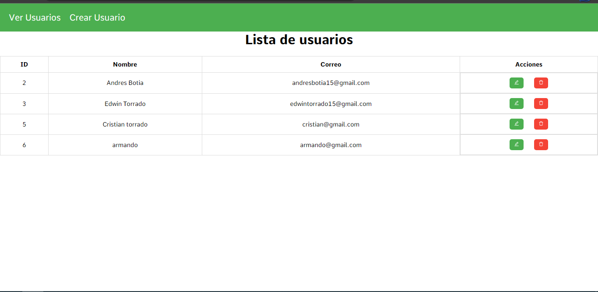
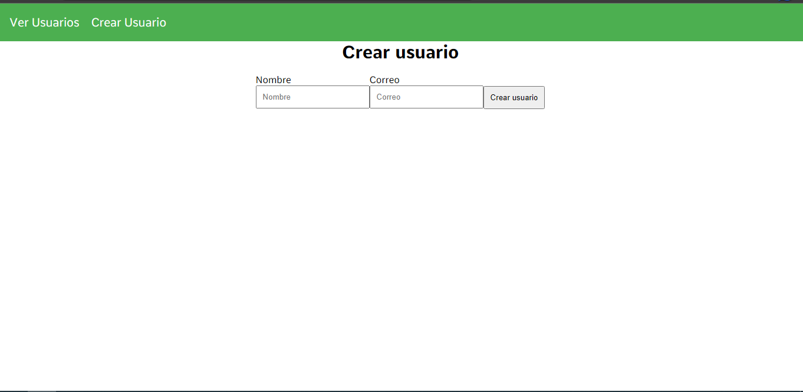

Proyecto web

Como usar las endpoints
- http://localhost:3000/api/usuarios/...

En el archivo userRoutes esta lo que se le concatena a la base del URI segun la peticion que se desee hacer.

Requisitos

- Instalar las dependencias de cada carpeta con "npm install o npm i"

Levantar el backend

- Ejecutando el comando "npm start"

Levantar el frontend

- Ejecutando el comando "npm run dev"

Captures

